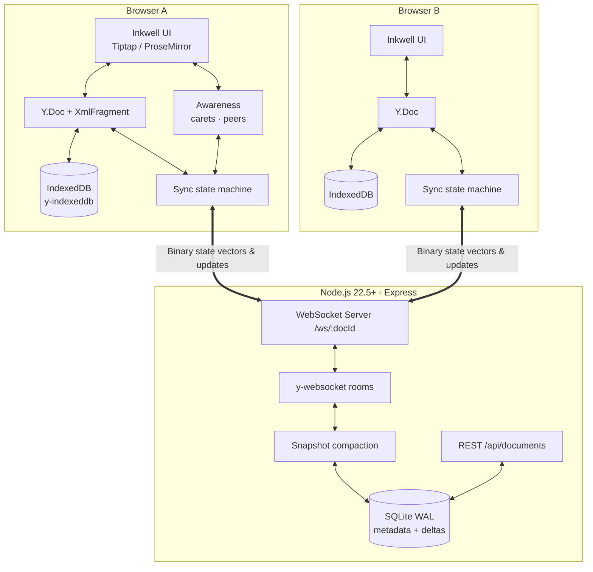
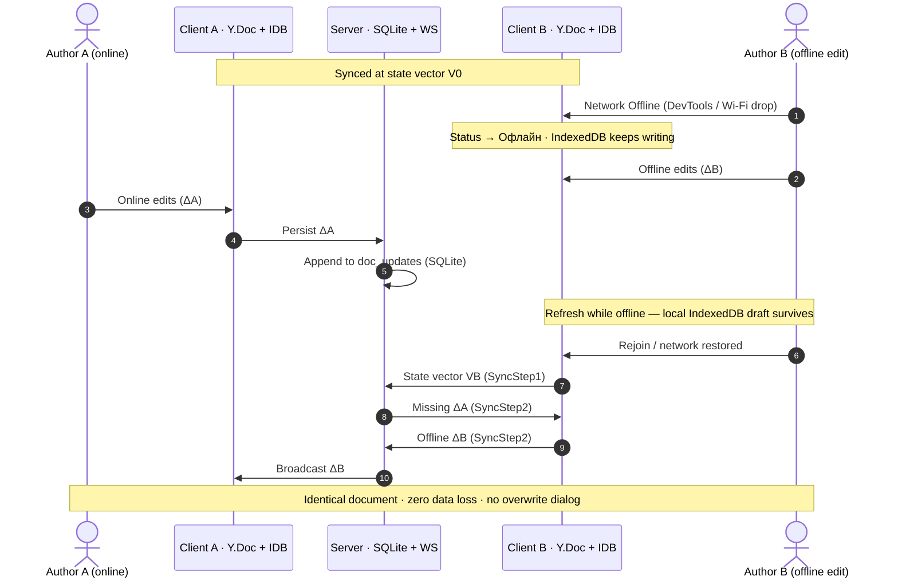

# Inkwell — Collaborative Document Editor

### Local-first collaborative document editor with CRDT sync

[](https://react.dev/)
[](https://vitejs.dev/)
[](https://github.com/yjs/yjs)
[](https://tiptap.dev/)
[](https://nodejs.org)
[](LICENSE)

A full-stack web document editor built for **real-time multi-author editing**, **true offline durability**, and an **original Inkwell design** — not a Google Docs visual clone and not a stock UI-kit theme.

**Stack:** React · Vite · TipTap/ProseMirror · Yjs · Express · WebSockets (`ws`) · SQLite (`node:sqlite`) · IndexedDB

---

## Run the project

**Need:** Node.js 22.5+ *(uses native `node:sqlite` — no Visual Studio / C++ compilation required)*

### 1. Server

```bash
cd server
npm install
npm start          # http://localhost:4000
```

### 2. Client

```bash
cd client
cp .env.example .env
npm install
npm run dev             # http://localhost:5173
```

Wait until both `server` and `client` are up, then open:

| What | URL |
| :--- | :--- |
| **App (use this)** | http://localhost:5173 |
| **API + WebSocket** | http://localhost:4000 |

### Cold start (video / first run)

1. `cd server && npm install && npm start`
2. In a second terminal: `cd client && npm install && npm run dev`
3. Open http://localhost:5173
4. Create a document or open an existing document; for collab, paste the same URL in a second window or browser tab.

No external `.env` setup or database installation required. SQLite database is created automatically under `server/data/inkwell.sqlite3`.

---

## Assignment coverage (MVP checklist)

| Requirement | How Inkwell delivers it |
| :--- | :--- |
| **Rich text editing**: bold, italic, headings, lists | TipTap 3 editor + format toolbar (bold, italic, underline, strike, headings, bullet list, ordered list, task list, font size `- [16] +`, color & highlight swatches, align, links, images) |
| **Real-time collaboration** (≥2 tabs/browsers) | Yjs CRDT over WebSocket (`ws` + `y-websocket`); instant state propagation without page reload |
| **Offline edit → local persist → correct merge** | `y-indexeddb` local storage; state-vector delta merge on reconnect — no data loss or overwrite dialogs |
| **Presence / cursors** | Named colored carets (`CollaborationCaret`), peer avatars bar (`PresenceBar`), peer count (`в документе: N`), auto-cleanup on disconnect |
| **Document persistence** | SQLite via `node:sqlite` (metadata + append-only CRDT updates WAL + snapshot compaction) + client IndexedDB |
| **Original design system** | Inkwell: warm paper desk (`--paper`), ink text (`--ink`), marine teal active accent (`--marine`), brass detail (`--brass`), Fraunces + Source Serif 4 + Public Sans typography |

---

## Table of contents

1. [Run the project](#run-the-project)
2. [Assignment coverage (MVP checklist)](#assignment-coverage-mvp-checklist)
3. [Architecture](#architecture)
4. [Why Yjs (CRDT) for sync & offline](#why-yjs-crdt-for-sync--offline)
5. [Offline-first lifecycle](#offline-first-lifecycle)
6. [Design system — Inkwell](#design-system--inkwell)
7. [Product surface](#product-surface)
8. [Project structure](#project-structure)

---

## Architecture



### Highlights

- **Architecture:** `client` (React SPA) + `server` (Express REST + WebSocket server)
- **Server:** Express + `ws`; native Node.js 22.5+ `node:sqlite` — zero native C++ build tools required
- **Client durability:** every keystroke is written directly to browser IndexedDB via `y-indexeddb` before network transmission
- **Offline resilience:** document edits accumulate locally and automatically merge upon WebSocket reconnection
- **Presence:** real-time awareness channel tracks connected peer names, colors, and live selection carets
- **SQLite WAL & Snapshots:** incremental updates are saved in `doc_updates` log; automatically compacted into `doc_snapshots` after 150 edits to keep document loading instantaneous

---

## Why Yjs (CRDT) for sync & offline

The assignment brief allows any CRDT/OT library. Writing OT from scratch is **not** a plus. We chose **Yjs** deliberately:

| Criterion | Classic OT | Yjs CRDT |
| :--- | :--- | :--- |
| **Network model** | Central sequencer for every op | Commutative binary updates; any arrival order |
| **Offline** | Fragile transform histories | Native: exchange state vectors, merge |
| **Integrity** | Split/merge edge cases | Strong eventual consistency |
| **Server role** | Heavy transform CPU | Relay + persist (+ compaction) |
| **Editor fit** | Custom wiring | Official ProseMirror / TipTap + awareness |

**Why Yjs over Automerge here:** compact binary encoding (`lib0`), battle-tested TipTap collaboration + cursor plugins, and low latency for character-level editing.

The server is **not** the source of truth for merge math — the CRDT is. SQLite stores updates/snapshots so rooms can reload state after server restarts.

---

## Offline-first lifecycle

This is the criterion the assignment brief says is most often faked. Inkwell treats it as a first-class path.



### Demo controls in the UI

1. **Network status indicator** in header (`В сети — изменения сохранены` / `Офлайн — правки сохраняются локально`)
2. **Offline Network toggle** in DevTools (`F12` → `Network` → `Offline`)
3. **Persona avatar bar** — distinct caret colors for peers (Quick Guest #1, #2, etc.)
4. **IndexedDB local persistence** — edits survive tab refreshes even while offline

---

## Design system — Inkwell

Assignment requirement:

> Design must be original — **not a copy of Google Docs** and not a default UI-framework theme. Judged on **system consistency**: palette, icons, spacing, typography.

| Token | Color / Style | Role |
| :--- | :--- | :--- |
| **Paper (`--paper`)** | `#f4f1ea` / `#e9e4d9` | Desk background & paper sheet |
| **Ink (`--ink`)** | `#1b2a2f` | Dark blue-black text & primary icons |
| **Marine (`--marine`)** | `#2f5d62` | Active buttons, network online indicator, active toolbar items |
| **Brass (`--brass`)** | `#b3812f` | Secondary accent, quote markers, notes |
| **Pen colors (`--pen-1…6`)** | Curated 6 muted tones | Unique participant cursor colors & avatars |
| **Typography** | Fraunces · Source Serif 4 · Public Sans | Fraunces (brand/titles), Source Serif 4 (document body), Public Sans (UI chrome) |

**Product metaphor:** a warm writing desk with an aged paper sheet under ink pens. Network status is subtle text typography (`В сети`), and colors are curated to evoke traditional paper and ink crafting.

---

## Product surface

Beyond the MVP floor:

- **Documents Ledger:** grid view of documents with live text preview extracted directly from Yjs state, create card, inline title renaming, and deletion modal
- **Editor Canvas:** clean document sheet with real-time word/character count, outline sidebar, presence header bar, and connection status indicator
- **Font Size Control:** precise step controller (`- [ 16 ] +`) to adjust text font size dynamically
- **Formatting Toolbar:** heading styles (Paragraph, H1, H2, H3), bold, italic, underline, strike, text color swatch, highlight marker swatch, link prompt, image by URL prompt, text alignment (left, center, right, justify), bullet list, numbered list, task list with checkboxes, blockquote, indent increase/decrease, clear formatting
- **Table of Contents (Outline):** auto-updating sidebar tracking H1–H3 headings with one-click navigation
- **Presence & Live Carets:** live user selection carets with colored labels and header avatar facepile

---

## Project structure

```
docs-clone/
├── client/                     # Frontend (React 19 + Vite + Tiptap + Yjs)
│   ├── src/
│   │   ├── components/         # UI Components (Toolbar, PresenceBar, ConnectionStatus, OutlineSidebar, DocumentCard)
│   │   ├── lib/                # Custom Hooks & Extensions (useCollaborativeDoc, usePresence, useOutline, fontSize)
│   │   ├── pages/              # Pages (DocumentsList, EditorPage)
│   │   ├── styles/             # Design Tokens & Styling (tokens.css, app.css)
│   │   ├── App.jsx             # React Router setup
│   │   └── main.jsx            # React root entry
│   ├── package.json
│   └── vite.config.js
│
├── server/                     # Backend (Node.js 22.5+ + Express + ws + node:sqlite)
│   ├── src/
│   │   ├── db/                 # SQLite database schema, WAL updates log & snapshot compaction (database.js, persistence.js)
│   │   ├── ws/                 # Yjs sync rooms & awareness protocol handlers (rooms.js, sync.js)
│   │   └── index.js            # Express REST API & HTTP/WebSocket server
│   └── package.json
│
├── VIDEO_GUIDE.md              # Step-by-step demonstration video script & instructions
├── README.md                   # Complete project documentation
└── task.txt                    # Original assignment specifications
```

---

## License

MIT. Built for the Inkwell collaborative document editor challenge.
